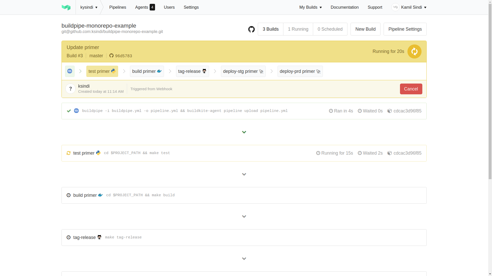
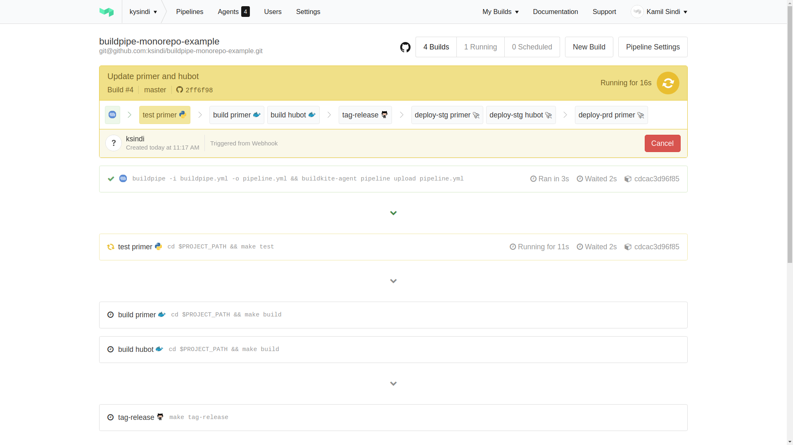

# Buildpipe Monorepo Example

Example monorepo using third-party buildkite tool [buildpipe](https://github.com/ksindi/buildpipe/).

The monorepo config lives in [buildpipe.yml](https://github.com/ksindi/buildpipe-monorepo-example/blob/master/buildpipe.yml).
You can see there are 3 projects defined and deploy steps only happen during Eastern time business hours.

The config shows steps the projects share with their associated commands. The commands are standardized using `make` and Makefile inheritance.

## Getting started

1. Create a pipeline adding the following initial step
    ```bash
    buildpipe -i buildpipe.yml -o pipeline.yml
    buildkite-agent pipeline upload pipeline.yml
    ```
    
1. Generate deploy key and change permissions
    ```bash
    make generate-deploy-ssh-key
    chmod 600 ~/buildkite-secrets/id_rsa_buildkite_git
    ```
1. Add the public key `~/buildkite-secrets/id_rsa_buildkite_git.pub` to your Github repo under Settings > Deploy keys.
    
1. Run the buildkite agents locally:
    ```bash
    export BUILDKITE_AGENT_TOKEN=<token>

    # Start ssh agent in the background
    eval "$(ssh-agent -s)"

    # Add key
    ssh-add ~/buildkite-secrets/id_rsa_buildkite_git

    # Run agent in a docker container scaled to the number of cpus
    cd buildkite-agent/ && make local
    ```
You should see the number of agents at the top bar in buildkite appear

## Examples
The following examples shows how the pipeline creation is dynamic depending on which projects
were changes by git.

1. Updating primer project in master only triggers the primer pipeline to run
    
1. Updating both primer and hubots projects in master triggers both pipelines
    
